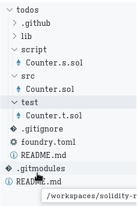

## Foundry

**Foundry is a blazing fast, portable and modular toolkit for Ethereum application development written in Rust.**

Foundry consists of:

-   **Forge**: Ethereum testing framework (like Truffle, Hardhat and DappTools).
-   **Cast**: Swiss army knife for interacting with EVM smart contracts, sending transactions and getting chain data.
-   **Anvil**: Local Ethereum node, akin to Ganache, Hardhat Network.
-   **Chisel**: Fast, utilitarian, and verbose solidity REPL.

## Documentation

https://book.getfoundry.sh/

## Usage

### Build

```shell
$ forge build
```

### Test

```shell
$ forge test
```

### Format

```shell
$ forge fmt
```

### Gas Snapshots

```shell
$ forge snapshot
```

### Anvil

```shell
$ anvil
```

### Deploy

```shell
$ forge script script/Counter.s.sol:CounterScript --rpc-url <your_rpc_url> --private-key <your_private_key>
```

### Cast

```shell
$ cast <subcommand>
```

### Help

```shell
$ forge --help
$ anvil --help
$ cast --help
```

# Backend of the TODO APP

Step 1:
Installing Foundryup and Foundry

Check the version by `forge --version`


Step 2:
The TODO Smart Contract

`forge init --force todos`
This creates a new dir called todos. Which holds your smart contract projects alongside Foundry related files.


Head to the new todos directory. Delete the following files based on the following paths:

src/Counter.sol 
script/Counter.s.sol
test/Counter.t.sol
Create a new file called Todos.sol in the src directory.

It had a contract named Todos
Edit the contract based on the utility functions like
createTodo
updateTodo
deleteTodo
getTodo -- gets the todo based onthe todo ID param
getTodoByOwner -- gets the list of todo items by the owner address

format the code `forge fmt`
compile the code  `forge compile`

Step 3:
Adding The Tests

add test for the contract to pass before the deployment. At test/Todos.t.sol

Then run the test `forge test`

### Step 4: Deployment 
ADD Infura RPC URL -- select Ethereum Sepoila net
ADD etherscan API key

Add this as .env

```bash
SEPOLIA_RPC_URL=https://sepolia.infura.io/v3/YOUR_INFURA_SEPOLIA_API_KEY
PRIVATE_KEY=0xYOUR_PRIVATE_KEY
ETHERSCAN_API_KEY=YOUR_ETHERSCAN_API_KEY
```


Step 12:
Deploying The Todos Smart Contract
In this step, we will verify and publish our Todos smart contract on Sepolia.

Load Environment Variables
We will start by loading our environment variables from Step 10!

Navigate to the todos directory and run the following command.

`source .env`
This command loads the environment variables defined in our.env file (SEPOLIA_RPC_URL and PRIVATE_KEY).

Next, deploy your Todos smart contract to the Sepolia network and verify it on Sepolia by running the following command:

```bash
forge create --rpc-url "${SEPOLIA_RPC_URL}" --broadcast --private-key "${PRIVATE_KEY}" --verifier-url "https://api-sepolia.etherscan.io/api" -e "${ETHERSCAN_API_KEY}" --verify src/Todos.sol:Todos
```

#### Explanation -- 
- forge create - This command deploys the smart contract using Foundry
- --rpc-url “${SEPOLIA_RPC_URL}” - Specifies the RPC URL for Sepolia defined in the .env file
- --private-key “${PRIVATE_KEY}” - Uses the private key from the .env file to sign the deployment transaction
- --verifier-url “https://sepolia.etherscan.io/api” - Specifies the URL for the Sepolia API which is used to verify the Forum smart contract
- -e “${ETHERSCAN_API_KEY}” - Uses the API_key from the .env file for verification
- --verify src/Todos.sol:Todos - Instructs Foundry to verify the smart contract after deployment

This command will deploy our Todos smart contract to the Sepolia network and automatically verify and publish it on Sepolia.

Check the Etherscan for the deployed smart contract. 